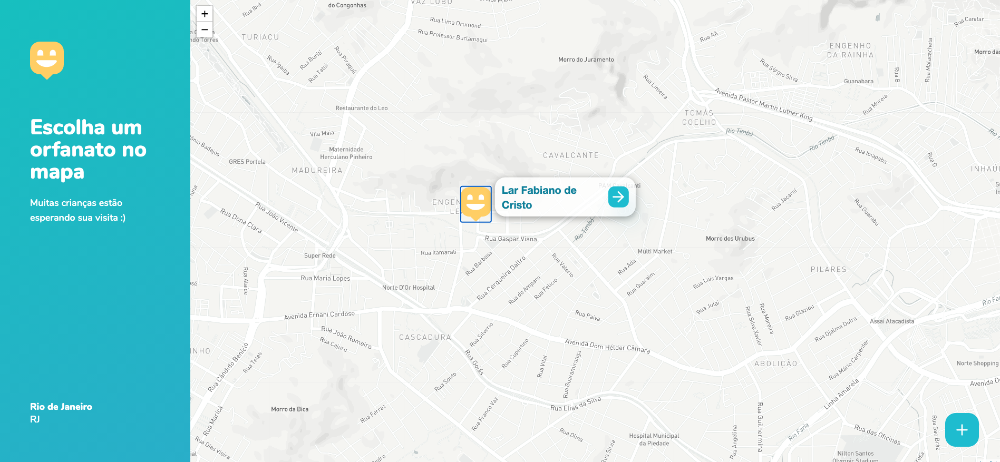
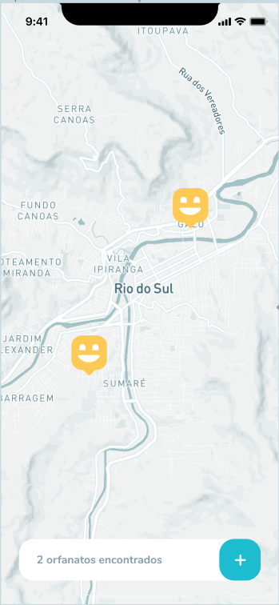
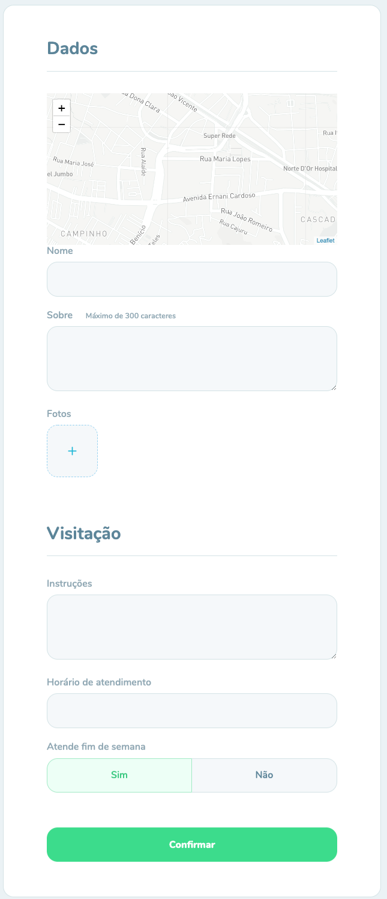

# Happy Projetc - V1 

Projeto de sistema para cadastro de orfanatos, disponibilizando os dados de endereço, horario de funcionamento, dias de visita e informações sobre a instituição.

## Estrutura
O projeto conta com uma estrtura de backend, uma versão web e uma mobile.

### Landing Page
[](images/landing-page.png)

### Web
[](images/web-home.png)

### Home Mobile
[](images/mobile-home.png)

### Form de cadastro e detalhes do orfanato
[](images/mobile-form.png)
[](images/mobile-detail.png)

# Instalação
O projeto esta dividido em 3 pastas ( backend / Web /mobile) cada com a sua estrura de projeto e suas dependenncias.

## Backend
O sistema necessita que do [Node.js](https://nodejs.org/en/) e de um gerenciador de pacotes para que seja executado. Neste projeto optei pelo utilização de [Yarn](https://yarnpkg.com/).

### Instalação
```
yarn install
```

### Run
```
yarn dev
```
Após a inicialização o API estará disponivel em **http://localhost:3333**.

### API REST
API possui os seguinte endpoints:
#### GET /orphanages
Retorna um array de JSON com todos os orfanatos cadastrados.
#### GET /orphanages/:ID
Retorna um JSON com todos as informações de determinado orfanato.
#### POST /orphanages/
Cadastra um novo orfanato na base. Ele recebe uma multipart Form com os seguintes campos:

```
name: text
latitude: float;
longitude: float;
about: text;
intructions: text;
opening_hours: text;
opening_on_weekends: boolean;
images: array de imagens;
```
## WEB

A versão WEB estara acessive pelo endereço  **http://localhost:3000/**

### Instalação
```
yarn install
```

### Run
```
yarn start
```

## Mobile
A versão mobile necessita da instalação do [expo-cli](https://docs.expo.io/workflow/expo-cli/) para utilização de sua bibliotecas. 

```
npm install -g expo-cli
```

Para rodar a aplicação direto no celular utiliza o Expo Client em seu aparelho. Em caso de duvidas este [Post](https://itnext.io/set-up-react-native-with-expo-1e63a82d01ac) explica passo a passo.

### Instalação
```
yarn install
```

### Run
```
expo start
```
